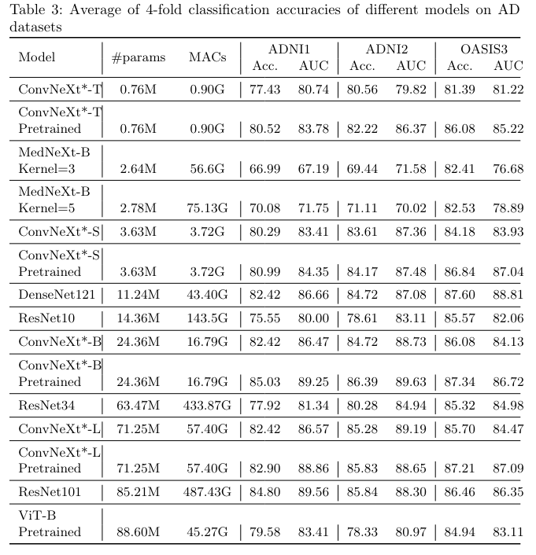

# Modified ConvNeXt for Alzheimer's disease classification

The code of "Designing efficient 3D-ConvNeXt model for Alzheimer's Disease classification" paper.


# Training

## Installation

```bash
conda create -n convnextv2 python=3.8 -y
conda activate convnextv2
```

Install pytorch. Make sure Pytorch must have version >=1.8.0+cuda same as in `/usr/local/cuda`. For example, if `cat /usr/local/cuda/version.txt` is `CUDA 11.7`, then run:

```bash
# the version we used
pip install torch==1.13.1+cu117 torchvision==0.14.1+cu117 torchaudio==0.13.1 --extra-index-url https://download.pytorch.org/whl/cu117

```

Then, follow the instruction [here](./minkowski_install.md) to install MinkowskiEngine

Finally, other packages can be installed with:

```bash
pip install -r requirements.txt
```

## Pre-training

IXI, and HCP datasets were used for pre-training. Here is the sample command for MAE pre-training:

```bash
python pretrain.py  --config_file configs/pretrain_convnext_sparse.yaml  --savename convnext_sparse_pt_dim128_HCP_IXI_ --mode pretraining --datasets_to_use HCP IXI  --seed 42 --devices 0 --mask_ratio 0.6 --use_aug --size base --decoder_dim 128
```

The pre-trained models can be downloaded from [here](https://drive.google.com/drive/folders/1wnicwNFi3DXjgl5UryIbaDs0B1Ra4o6l?usp=sharing).

## Fine-tuning

You must specify the dataset name and config file. If you dont' have a pre-trained checkpoint, you can omit `--use_pretrained` argument. Here is the example:
```bash

python kfold_train.py  --config_file ./configs/convnext3d.yaml --classes_to_use CN AD  --savename convnext_sparse_dim128_HCP_IXI --dataset ADNI2 --devices 3 --epochs 150 --optimizer AdamW --lr 0.00001 --scheduler cosine --batch_size 4 --size base   --kernel_size 7 --downsampling avgpool3d  --drop_path 0.1  --use_pretrained  ./checkpoints/convnext_sparse_pt_dim128_HCP_IXI__pretraining_seed_42_599_254400.pth.tar
```

# Comparison with other models



# Notes