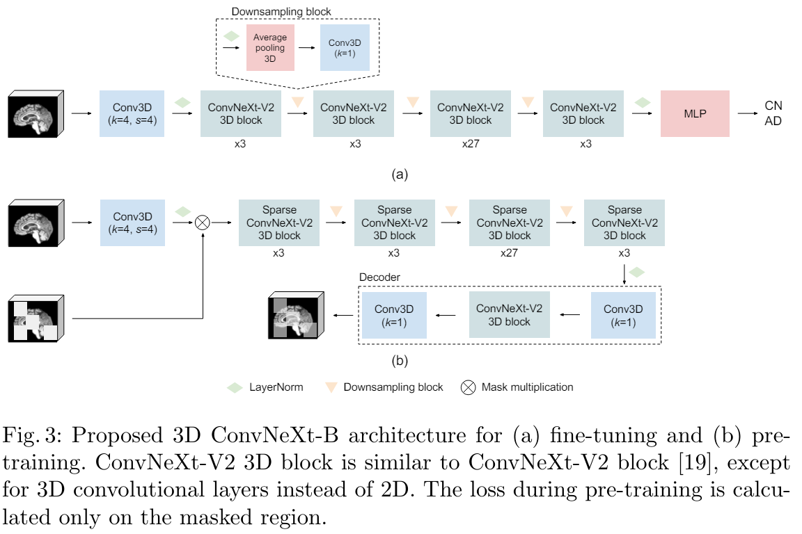

# AD-NeXt: AD Classification with Self-Supervised Pretraining

The code of "AD-NeXt: Efficient Alzheimer's Disease Classification with Self-Supervised Pretraining" paper.



# Training

## Installation

```bash
conda create -n convnextv2 python=3.8 -y
conda activate convnextv2
```

Install pytorch. Make sure Pytorch must have version >=1.8.0+cuda same as in `/usr/local/cuda`. For example, if `cat /usr/local/cuda/version.txt` is `CUDA 11.7`, then run:

```bash
# the version we used
pip install torch==1.13.1+cu117 torchvision==0.14.1+cu117 torchaudio==0.13.1 --extra-index-url https://download.pytorch.org/whl/cu117

```

Then, follow the instruction [here](./minkowski_install.md) to install MinkowskiEngine

Finally, other packages can be installed with:

```bash
pip install -r requirements.txt
```

## Pre-training

IXI, and HCP datasets were used for pre-training. Here is the sample command for MAE pre-training:

```bash
python pretrain.py  --config_file configs/pretrain_convnext_sparse.yaml  --savename convnext_sparse_pt_dim128_HCP_IXI_ --mode pretraining --datasets_to_use HCP IXI  --seed 42 --devices 0 --mask_ratio 0.6 --use_aug --size base --decoder_dim 128
```

The pre-trained models can be downloaded from [here](https://drive.google.com/drive/folders/1wnicwNFi3DXjgl5UryIbaDs0B1Ra4o6l?usp=sharing).

## Fine-tuning

You must specify the dataset name and config file. If you dont' have a pre-trained checkpoint, you can omit `--use_pretrained` argument. Here is the example:
```bash

python kfold_train.py  --config_file ./configs/convnext3d.yaml --classes_to_use CN AD  --savename convnext_sparse_dim128_HCP_IXI --dataset ADNI2 --devices 3 --epochs 150 --optimizer AdamW --lr 0.00001 --scheduler cosine --batch_size 4 --size base   --kernel_size 7 --downsampling avgpool3d  --drop_path 0.1  --use_pretrained  ./checkpoints/convnext_sparse_pt_dim128_HCP_IXI__pretraining_seed_42_599_254400.pth.tar
```

# Comparison with other models

| Model                  | # Params | MACs   | ADNI1 Acc. | ADNI1 AUC | ADNI2 Acc. | ADNI2 AUC |
|------------------------|---------|--------|------------|-----------|------------|-----------|
| MedNeXt-B (kernel=3)   | 2.64M   | 56.6G  | 66.99      | 67.19     | 69.44      | 71.58     |
| MedNeXt-B (kernel=5)   | 2.78M   | 75.13G | 70.08      | 71.75     | 71.11      | 70.02     |
| DenseNet121            | 11.24M  | 43.40G | 82.42      | 86.66     | 84.72      | 87.08     |
| ResNet10               | 14.36M  | 143.5G | 75.55      | 80.00     | 78.61      | 83.11     |
| ResNet34               | 63.47M  | 433.87G| 77.92      | 81.34     | 80.28      | 84.94     |
| ResNet101              | 85.21M  | 487.43G| _84.80_    | **89.56** | _85.84_    | 88.30     |
| ViT-B (pre-trained)    | 88.60M  | 45.27G | 79.58      | 83.41     | 78.33      | 80.97     |
| AD-NeXt-T             | 0.76M   | 0.90G  | 77.43      | 80.74     | 80.56      | 79.82     |
| AD-NeXt-T (pre-trained)| 0.76M   | 0.90G  | 80.52      | 83.78     | 82.22      | 86.37     |
| AD-NeXt-S              | 3.63M   | 3.72G  | 80.29      | 83.41     | 83.61      | 87.36     |
| AD-NeXt-S (pre-trained)| 3.63M   | 3.72G  | 80.99      | 84.35     | 84.17      | 87.48     |
| AD-NeXt-B              | 24.36M  | 16.79G | 82.42      | 86.47     | 84.72      | 88.73     |
| AD-NeXt-B (pre-trained)| 24.36M  | 16.79G | **85.03**  | _89.25_   | **86.39**  | **89.63** |
| AD-NeXt-L              | 71.25M  | 57.40G | 82.42      | 86.57     | 85.28      | _89.19_   |
| AD-NeXt-L (pre-trained)| 71.25M  | 57.40G | 82.90      | 88.86     | 85.83      | 88.65     |


# Notes
